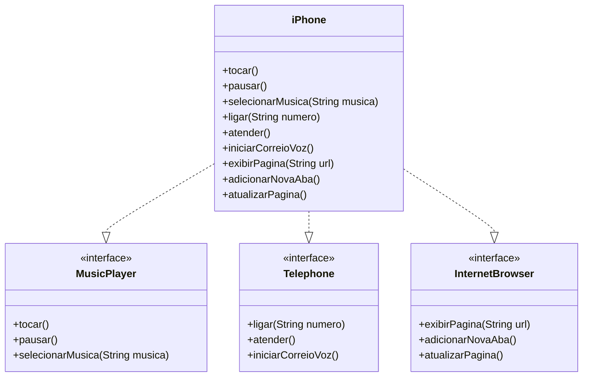

# Desafio Lançamento iPhone - DIO

## 📌 Descrição
O desafio **Lançamento iPhone** da **DIO (Digital Innovation One)** consiste na implementação de uma aplicação Java que simula as funcionalidades básicas de um iPhone. O programa permite interagir com um menu no console, oferecendo opções para tocar música, realizar chamadas e navegar na internet.

## 🛠 Tecnologias Utilizadas
- **Java** - Linguagem de programação principal do projeto
- **Paradigma de Programação Orientado a Objetos (POO)**
- **Interfaces e Implementações**
- **Diagrama UML**

## 🎯 Objetivo do Desafio
Implementar a classe `iPhone` que herda as funcionalidades de três interfaces:
1. `MusicPlayer` - Controle de reprodução de músicas
2. `Telephone` - Funções básicas de telefone
3. `InternetBrowser` - Funcionalidades de navegação na internet

## 📜 UML - Diagrama de Classes



## 📂 Estrutura do Código

### Interfaces

#### `MusicPlayer.java`
```java
public interface MusicPlayer {
    void tocar();
    void pausar();
    void selecionarMusica(String musica);
}
```

#### `Telephone.java`
```java
public interface Telephone {
    void ligar(String numero);
    void atender();
    void iniciarCorreioVoz();
}
```

#### `InternetBrowser.java`
```java
public interface InternetBrowser {
    void exibirPagina(String url);
    void adicionarNovaAba();
    void atualizarPagina();
}
```

### Implementação da Classe `iPhone`

#### `iPhone.java`
```java
public class iPhone implements MusicPlayer, Telephone, InternetBrowser {
    @Override
    public void tocar() {
        System.out.println("Reproduzindo música...");
    }
    
    @Override
    public void pausar() {
        System.out.println("Música pausada.");
    }
    
    @Override
    public void selecionarMusica(String musica) {
        System.out.println("Selecionando música: " + musica);
    }

    @Override
    public void ligar(String numero) {
        System.out.println("Ligando para: " + numero);
    }

    @Override
    public void atender() {
        System.out.println("Atendendo chamada...");
    }

    @Override
    public void iniciarCorreioVoz() {
        System.out.println("Iniciando correio de voz...");
    }

    @Override
    public void exibirPagina(String url) {
        System.out.println("Exibindo página: " + url);
    }

    @Override
    public void adicionarNovaAba() {
        System.out.println("Nova aba adicionada.");
    }

    @Override
    public void atualizarPagina() {
        System.out.println("Página atualizada.");
    }
}
```

### Classe `Main` - Execução do Programa

#### `Main.java`
```java
import java.util.Scanner;

public class Main {
    public static void main(String[] args) {
        Scanner scanner = new Scanner(System.in);
        iPhone meuIphone = new iPhone();

        while (true) {
            System.out.println("\nEscolha uma opção:");
            System.out.println("1. Tocar música");
            System.out.println("2. Pausar música");
            System.out.println("3. Selecionar música");
            System.out.println("4. Ligar");
            System.out.println("5. Atender");
            System.out.println("6. Iniciar correio de voz");
            System.out.println("7. Exibir página");
            System.out.println("8. Adicionar nova aba");
            System.out.println("9. Atualizar página");
            System.out.println("0. Sair");
            System.out.print("Opção: ");
            int opcao = scanner.nextInt();
            scanner.nextLine();

            switch (opcao) {
                case 1:
                    meuIphone.tocar();
                    break;
                case 2:
                    meuIphone.pausar();
                    break;
                case 3:
                    System.out.print("Digite o nome da música: ");
                    String musica = scanner.nextLine();
                    meuIphone.selecionarMusica(musica);
                    break;
                case 4:
                    System.out.print("Digite o número para ligar: ");
                    String numero = scanner.nextLine();
                    meuIphone.ligar(numero);
                    break;
                case 5:
                    meuIphone.atender();
                    break;
                case 6:
                    meuIphone.iniciarCorreioVoz();
                    break;
                case 7:
                    System.out.print("Digite a URL da página: ");
                    String url = scanner.nextLine();
                    meuIphone.exibirPagina(url);
                    break;
                case 8:
                    meuIphone.adicionarNovaAba();
                    break;
                case 9:
                    meuIphone.atualizarPagina();
                    break;
                case 0:
                    System.out.println("Saindo...");
                    scanner.close();
                    return;
                default:
                    System.out.println("Opção inválida. Tente novamente.");
            }
        }
    }
}
```

## 🚀 Como Executar o Projeto
1. Clone este repositório
2. Compile os arquivos `.java`
3. Execute o `Main.java`
4. Interaja com o menu exibido no console

## 📌 Conclusão
Este projeto demonstra a aplicação de **interfaces**, **herança**, **polimorfismo** e **programação orientada a objetos (POO)**, promovendo uma abordagem modular e reutilizável para sistemas complexos.

---
🚀 Desafio proposto pela **Digital Innovation One** 🎯

